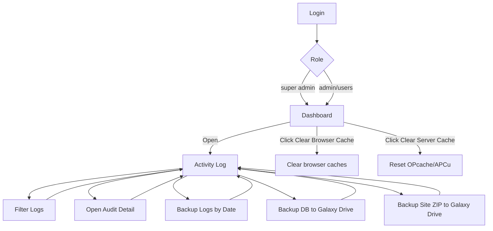

# UI Flow: Galaxy Travel (v1.2.0)

## Overview
Dokumen ini menjelaskan alur UI utama untuk fitur kontrol sistem yang baru ditambahkan.

## Daftar Halaman
- Dashboard
- Activity Log
- Login History
- Backup Logs (manual)
- System Backups (DB & Site)

## Flow Diagram (Mermaid)

## Langkah Kunci

### Dashboard
- Tombol: Clear Cache Browser (semua role)
- Tombol: Clear Cache Server (super admin)
- Dampak: notifikasi melayang, reload paksa (browser), reset OPcache/APCu (server)

### Activity Log (Super Admin)
- Filter berdasarkan user, jenis aktivitas, tabel, rentang tanggal, IP
- Tabel daftar log + tombol Detail untuk audit trail per field
- Statistik singkat di bagian atas
- Tombol backup:
  - Backup by Date → JSON di `assets/backup/backups/`
  - Backup DB → `galaxy_drive/backups/db_*.sql|json`
  - Backup Site → `galaxy_drive/backups/site_*.zip`

### Login History (Super Admin)
- Tabel login/logout + durasi, status success/failed, IP, user-agent

## Screenshots (Placeholder)
Letakkan file screenshot pada direktori `docs/screenshots/`:
- Activity Log main: `docs/screenshots/activity_log.png`
- Audit detail: `docs/screenshots/audit_detail.png`
- Login History: `docs/screenshots/login_history.png`
- Backup di Activity Log: `docs/screenshots/backup_controls.png`
- Tombol cache di Dashboard: `docs/screenshots/dashboard_cache.png`

## Catatan Teknis
- Setiap aksi backup & clear cache server tercatat di Activity Log
- Akses edit/delete terkunci untuk super admin (kecuali edit pelanggan: admin diizinkan)
- Jika `mysqldump` tidak tersedia → fallback JSON export