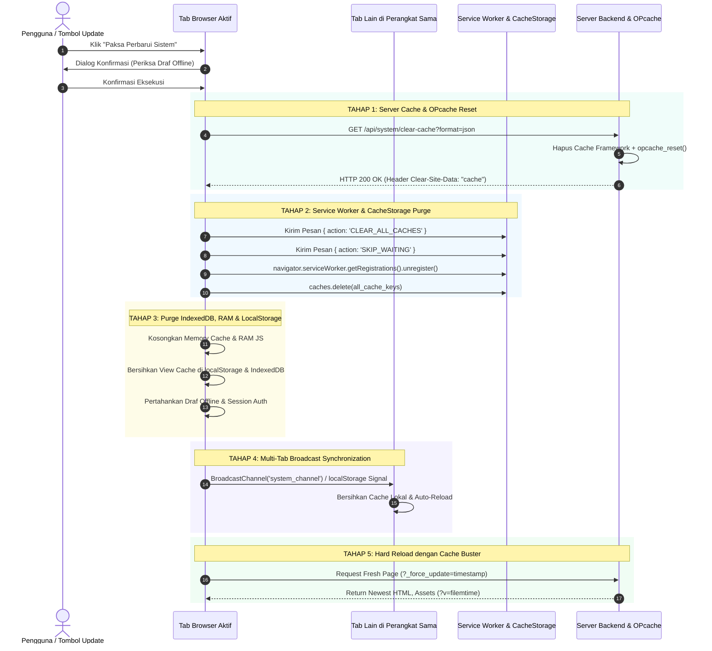

# PANDUAN TEKNIS: ARSITEKTUR & IMPLEMENTASI FITUR PAKSA PEMBARUAN SISTEM (FORCE SYSTEM UPDATE & CACHE INTAKE)

Dokumen ini menjelaskan rancangan arsitektur, alur kerja teknis, dan kode siap pakai untuk fitur **Paksa Pembaruan Sistem (Force System Update & Stale Cache Purge)**. Fitur ini dirancang untuk dapat diimplementasikan ke berbagai sistem web (CodeIgniter, Laravel, WordPress, Node.js/Express, maupun Native PHP/HTML) guna menyelesaikan masalah *stale cache* (browser klien tertahan pada kode lama setelah server diperbarui).

---

## 1. Latar Belakang Masalah (*Problem Statement*)

Saat pengembang mengunggah kode atau aset baru (HTML, CSS, JS, PHP) ke server produksi, pengguna sering kali masih melihat tampilan atau fungsionalitas versi lama. Hal ini disebabkan oleh berlapisnya mekanisme penyimpanan *cache*:
1. **PHP OPcache di Server**: Menyimpan *precompiled bytecode* skrip PHP di memori server sehingga perubahan file `.php` tidak langsung dieksekusi.
2. **HTTP Disk / Memory Cache Browser**: Menyimpan file CSS, JS, dan respons HTML berdasarkan header HTTP *caching*.
3. **Service Worker & CacheStorage (PWA)**: Menyimpan aset statis dan navigasi halaman untuk mode *offline*.
4. **Client-Side Storage**: Data usang yang tersimpan di `IndexedDB`, `localStorage`, atau `sessionStorage`.

**Solusi Konvensional (Tidak Efektif)**: Meminta pengguna melakukan *Hard Reload* (`Ctrl + Shift + R` atau `Ctrl + F5`) atau menghapus riwayat browser manual. Pendekatan ini rentan kesalahan manusia (*human error*) dan membingungkan pengguna non-teknis.

**Solusi Arsitektur Ini**: Menyediakan **1-Click / Automated Force Update Pipeline** yang secara terorkestrasi membersihkan seluruh lapisan *cache* (Server, Service Worker, Client Storage, dan Multi-Tab) dalam hitungan detik secara aman.

---

## 2. Diagram Alur Kerja (*System Sequence Diagram*)



---

## 3. Empat Pilar Arsitektur Teknis

### Pilar 1: Server Backend & OPcache Reset
- Menghapus berkas *cache* aplikasi/framework (seperti `storage/framework/cache` di Laravel atau `writable/cache` di CodeIgniter).
- Mengeksekusi `opcache_reset()` untuk memaksa modul PHP mengkompilasi ulang berkas skrip PHP yang baru dimodifikasi.
- Mengirimkan header respon HTTP resmi W3C: `Clear-Site-Data: "cache"`, yang memerintahkan mesin browser (*Chromium / Firefox / WebKit*) mengosongkan *network cache* internalnya tanpa menghapus *cookie* sesi login.

### Pilar 2: Service Worker Lifecycle & CacheStorage Invalidation
- Menggunakan opsi `{ updateViaCache: 'none' }` saat registrasi Service Worker agar browser selalu memeriksa file `sw.js` terbaru langsung ke server tanpa terhambat *cache*.
- Mengirim sinyal `SKIP_WAITING` agar Service Worker versi baru langsung aktif (*take control*) tanpa menunggu seluruh tab ditutup.
- Menghapus seluruh instansi `CacheStorage` yang menampung file HTML/CSS/JS lama.

### Pilar 3: Client Storage Safe Purge (Pembersihan Selektif)
- Mengosongkan data tampilan di memori RAM JS, `sessionStorage`, `localStorage` (kunci `view_*`), dan *object store* `IndexedDB`.
- **Perlindungan Data**: Draf transaksi *offline* yang belum tersinkron dan sesi otentikasi login **tidak boleh dihapus** (*selective preservation*).

### Pilar 4: Multi-Tab Broadcast Synchronization
- Menggunakan **`BroadcastChannel` API** dengan *fallback* **`window.addEventListener('storage')`**.
- Ketika pengguna menekan tombol pembaruan pada satu tab, sinyal disebarkan ke seluruh tab lain yang terbuka di perangkat yang sama, sehingga seluruh tab otomatis tersinkronisasi.

---

## 4. Modul Kode Lengkap Siap Pakai (*Ready-to-Use Code*)

### A. Frontend: `force-update-engine.js`
Simpan berkas ini di folder aset JavaScript publik Anda (misal: `public/assets/js/force-update-engine.js`).

```javascript
/**
 * ====================================================================================================
 * UNIVERSAL FORCE SYSTEM UPDATE & CACHE PURGE ENGINE
 * Framework-Agnostic Client-Side Orchestrator
 * ====================================================================================================
 */

class ForceUpdateEngine {
    constructor(options = {}) {
        this.clearCacheUrl = options.clearCacheUrl || '/api/system/clear-cache';
        this.channelName = options.channelName || 'app_system_update_channel';
        this.storageKey = options.storageKey || 'app_force_update_signal';
        this.preserveKeys = options.preserveKeys || ['token', 'ci_session', 'user_session'];
        this.systemChannel = null;

        this.initCrossTabListener();
    }

    /**
     * Inisialisasi Listener Sinkronisasi Lintas Tab
     */
    initCrossTabListener() {
        const self = this;

        // 1. BroadcastChannel API (Browser Modern)
        if (typeof BroadcastChannel !== 'undefined') {
            try {
                this.systemChannel = new BroadcastChannel(this.channelName);
                this.systemChannel.onmessage = (event) => {
                    if (event.data && event.data.action === 'FORCE_UPDATE_SIGNAL') {
                        console.log('[ForceUpdate] Menerima sinyal pembaruan dari tab lain.');
                        self.purgeLocalCaches().then(() => {
                            self.reloadWithCacheBuster(event.data.timestamp);
                        });
                    }
                };
            } catch (e) {}
        }

        // 2. StorageEvent Fallback (Cross-Tab via LocalStorage)
        window.addEventListener('storage', (e) => {
            if (e.key === self.storageKey && e.newValue) {
                console.log('[ForceUpdate] Menerima sinyal storage update dari tab lain.');
                self.purgeLocalCaches().then(() => {
                    self.reloadWithCacheBuster(e.newValue);
                });
            }
        });
    }

    /**
     * Bersihkan Penyimpanan Lokal Klien (RAM, LocalStorage, SessionStorage, IndexedDB, CacheStorage)
     */
    async purgeLocalCaches() {
        console.log('[ForceUpdate] Membersihkan penyimpanan lokal...');

        // 1. Bersihkan SessionStorage
        try {
            sessionStorage.clear();
        } catch (e) {}

        // 2. Bersihkan LocalStorage Selektif (Pertahankan Kunci Penting)
        try {
            const keysToRemove = [];
            for (let i = 0; i < localStorage.length; i++) {
                const key = localStorage.key(i);
                if (key && !this.preserveKeys.includes(key) && key !== this.storageKey) {
                    // Hapus kunci yang berawalan view_, cache_, atau draft yang tidak dilindungi
                    if (key.startsWith('view_') || key.startsWith('cache_') || key.startsWith('sw_')) {
                        keysToRemove.push(key);
                    }
                }
            }
            keysToRemove.forEach(k => localStorage.removeItem(k));
        } catch (e) {}

        // 3. Bersihkan CacheStorage (Service Worker Caches)
        if ('caches' in window) {
            try {
                const cacheNames = await caches.keys();
                await Promise.all(cacheNames.map(name => caches.delete(name)));
            } catch (e) {}
        }

        // 4. Unregister Service Workers
        if ('serviceWorker' in navigator) {
            try {
                const registrations = await navigator.serviceWorker.getRegistrations();
                for (const reg of registrations) {
                    if (reg.active) {
                        reg.active.postMessage({ action: 'CLEAR_ALL_CACHES' });
                        reg.active.postMessage({ action: 'SKIP_WAITING' });
                    }
                    await reg.unregister();
                }
            } catch (e) {}
        }

        return true;
    }

    /**
     * Eksekusi Alur Lengkap Paksa Pembaruan Sistem
     */
    async execute(interactive = true) {
        const self = this;

        const runPipeline = async () => {
            if (typeof Swal !== 'undefined') {
                Swal.fire({
                    title: 'Memperbarui Sistem & Kode...',
                    html: `
                        <div class="py-2 text-left" style="font-size: 13px; line-height: 1.6;">
                            <div id="step-server" class="mb-2 text-primary font-weight-bold">
                                <i class="fas fa-spinner fa-spin mr-2"></i> 1. Menyegarkan Cache Server &amp; OPcache PHP...
                            </div>
                            <div id="step-sw" class="mb-2 text-muted">
                                <i class="far fa-circle mr-2"></i> 2. Mengosongkan Service Worker &amp; CacheStorage...
                            </div>
                            <div id="step-client" class="mb-2 text-muted">
                                <i class="far fa-circle mr-2"></i> 3. Membersihkan Local Storage &amp; View Cache...
                            </div>
                            <div id="step-reload" class="text-muted">
                                <i class="far fa-circle mr-2"></i> 4. Memuat ulang aset &amp; kode versi terbaru...
                            </div>
                        </div>
                    `,
                    allowOutsideClick: false,
                    allowEscapeKey: false,
                    showConfirmButton: false,
                    didOpen: async () => {
                        Swal.showLoading();

                        // Step 1: Panggil Server Clear Cache
                        try {
                            await fetch(self.clearCacheUrl, {
                                method: 'GET',
                                headers: {
                                    'Accept': 'application/json',
                                    'X-Requested-With': 'XMLHttpRequest'
                                }
                            });
                        } catch (e) {
                            console.warn('[ForceUpdate] Server call warning:', e);
                        }

                        $('#step-server').removeClass('text-primary font-weight-bold').addClass('text-success').html('<i class="fas fa-check-circle mr-2"></i> 1. Cache Server &amp; OPcache Berhasil Dikosongkan');
                        $('#step-sw').removeClass('text-muted').addClass('text-primary font-weight-bold').html('<i class="fas fa-spinner fa-spin mr-2"></i> 2. Mengosongkan Service Worker &amp; CacheStorage...');

                        await new Promise(r => setTimeout(r, 200));

                        // Step 2 & 3: Purge Client & Service Worker
                        await self.purgeLocalCaches();

                        $('#step-sw').removeClass('text-primary font-weight-bold').addClass('text-success').html('<i class="fas fa-check-circle mr-2"></i> 2. Service Worker &amp; CacheStorage Segar');
                        $('#step-client').removeClass('text-muted').addClass('text-success font-weight-bold').html('<i class="fas fa-check-circle mr-2"></i> 3. Penyimpanan Klien Bersih');
                        $('#step-reload').removeClass('text-muted').addClass('text-success font-weight-bold').html('<i class="fas fa-arrows-rotate fa-spin mr-2"></i> 4. Memuat Ulang Sistem dengan Kode Terbaru...');

                        await new Promise(r => setTimeout(r, 300));

                        // Step 4: Broadcast ke Tab Lain & Reload
                        const timestamp = Date.now();
                        try {
                            if (self.systemChannel) {
                                self.systemChannel.postMessage({ action: 'FORCE_UPDATE_SIGNAL', timestamp: timestamp });
                            }
                        } catch (e) {}
                        try {
                            localStorage.setItem(self.storageKey, timestamp.toString());
                        } catch (e) {}

                        self.reloadWithCacheBuster(timestamp);
                    }
                });
            } else {
                // Fallback Native Alert
                if (interactive) alert('Memulai penyegaran cache dan pembaruan sistem...');
                await self.purgeLocalCaches();
                self.reloadWithCacheBuster(Date.now());
            }
        };

        if (!interactive) {
            return runPipeline();
        }

        // Tampilkan Dialog Konfirmasi
        if (typeof Swal !== 'undefined') {
            Swal.fire({
                title: 'Paksa Perbarui Sistem?',
                html: 'Seluruh cache browser di komputer ini (OPcache Server, Service Worker, dan Cache Tampilan) akan disegarkan agar langsung menerima pembaruan fitur terbaru.',
                icon: 'question',
                showCancelButton: true,
                confirmButtonColor: '#0d9488',
                cancelButtonColor: '#64748b',
                confirmButtonText: '<i class="fas fa-arrows-rotate mr-1"></i> Ya, Perbarui Sekarang',
                cancelButtonText: 'Batal',
                reverseButtons: true
            }).then((res) => {
                if (res.isConfirmed) {
                    runPipeline();
                }
            });
        } else {
            if (confirm('Perbarui sistem dan segarkan seluruh cache untuk mendapatkan kode terbaru?')) {
                runPipeline();
            }
        }
    }

    /**
     * Memuat Ulang Halaman dengan Query Parameter Cache Buster
     */
    reloadWithCacheBuster(timestamp) {
        const ts = timestamp || Date.now();
        const url = new URL(window.location.href);
        url.searchParams.set('_force_update', ts);
        window.location.href = url.toString();
    }
}

// Inisialisasi Global Instance
window.forceUpdateEngine = new ForceUpdateEngine();
window.forceUpdateSystem = function(interactive = true) {
    return window.forceUpdateEngine.execute(interactive);
};
```

---

### B. Backend Controller PHP: `ClearCacheController.php`

Contoh implementasi controller PHP (dapat digunakan di CodeIgniter 4, Laravel, atau Native PHP):

```php
<?php

namespace App\Controllers; // Sesuaikan namespace (misal: App\Http\Controllers untuk Laravel)

class ClearCacheController
{
    /**
     * Endpoint API / Web untuk Pembersihan Cache Server & OPcache
     * Route: GET/POST /api/system/clear-cache
     */
    public function clearCache()
    {
        // 1. Bersihkan Berkas Cache Aplikasi di Disk
        $cacheDir = sys_get_temp_dir() . '/cache'; // Sesuaikan direktori cache framework Anda
        if (defined('WRITEPATH')) {
            $cacheDir = WRITEPATH . 'cache'; // CodeIgniter 4
        } elseif (function_exists('storage_path')) {
            $cacheDir = storage_path('framework/cache/data'); // Laravel
        }

        $deletedFiles = 0;
        if (is_dir($cacheDir)) {
            $files = glob($cacheDir . '/*');
            foreach ($files as $file) {
                if (is_file($file) && !in_array(basename($file), ['.gitkeep', 'index.html'])) {
                    @unlink($file);
                    $deletedFiles++;
                }
            }
        }

        // 2. Bersihkan Framework Cache Service (Redis / Memcached / File)
        if (class_exists('\Config\Services') && method_exists('\Config\Services', 'cache')) {
            try {
                \Config\Services::cache()->clean(); // CodeIgniter 4
            } catch (\Throwable $e) {}
        } elseif (function_exists('cache') && is_object(cache())) {
            try {
                cache()->flush(); // Laravel
            } catch (\Throwable $e) {}
        }

        // 3. Reset PHP OPcache Bytecode di Memori Server
        $opcacheCleared = false;
        if (function_exists('opcache_reset')) {
            $opcacheCleared = @opcache_reset();
        }

        // 4. Kirimkan Respon dengan Header Clear-Site-Data W3C
        header('Content-Type: application/json; charset=utf-8');
        header('Clear-Site-Data: "cache"'); // Memerintahkan browser mengosongkan network HTTP cache

        echo json_encode([
            'status'          => 'success',
            'message'         => 'Cache server dan OPcache berhasil disegarkan!',
            'deleted_files'   => $deletedFiles,
            'opcache_cleared' => $opcacheCleared,
            'timestamp'       => time()
        ]);
        exit;
    }
}
```

---

### C. Service Worker PWA: `sw.js`
Simpan di direktori publik root (`public/sw.js`):

```javascript
const CACHE_NAME = 'app-static-v1';

// 1. Install Event
self.addEventListener('install', (event) => {
    self.skipWaiting(); // Langsung aktif tanpa menunggu tab lama ditutup
});

// 2. Activate Event
self.addEventListener('activate', (event) => {
    event.waitUntil(
        Promise.all([
            self.clients.claim(),
            caches.keys().then(keys => Promise.all(keys.map(k => k !== CACHE_NAME ? caches.delete(k) : null)))
        ])
    );
});

// 3. Message Event (Menerima sinyal dari ForceUpdateEngine)
self.addEventListener('message', (event) => {
    if (!event.data) return;
    if (event.data.action === 'SKIP_WAITING') {
        self.skipWaiting();
    }
    if (event.data.action === 'CLEAR_ALL_CACHES') {
        caches.keys().then(keys => Promise.all(keys.map(k => caches.delete(k))));
    }
});
```

---

### D. Dynamic Asset Versioning (Anti-Cache Template)

Pada template layout utama (`header.php`, `layout.blade.php`, atau `layout.php`), pasang penanda versi dinamis berbasis `filemtime()` untuk seluruh berkas CSS & JS lokal:

```html
<!-- CSS dengan Cache Buster Otomatis -->
<link rel="stylesheet" href="/assets/css/style.css?v=<?= file_exists(FCPATH . 'assets/css/style.css') ? filemtime(FCPATH . 'assets/css/style.css') : time() ?>">

<!-- JS dengan Cache Buster Otomatis -->
<script src="/assets/js/app.js?v=<?= file_exists(FCPATH . 'assets/js/app.js') ? filemtime(FCPATH . 'assets/js/app.js') : time() ?>"></script>
```

*Penjelasan*: Fungsi `filemtime()` otomatis mengambil detik terakhir file tersebut diedit. Begitu file diubah/diupload, nilai `?v=...` otomatis berganti, sehingga browser klien 100% dipaksa mendownload versi baru tanpa perlu merubah kode HTML secara manual.

---

## 5. Panduan Penerapan Langkah demi Langkah (*Step-by-Step*)

Untuk menerapkan sistem ini ke website lain:

1. **Langkah 1**: Salin `ClearCacheController.php` ke folder Controller backend Anda dan daftarkan rute `GET /api/system/clear-cache`.
2. **Langkah 2**: Letakkan `sw.js` pada root folder publik (`public/sw.js`).
3. **Langkah 3**: Letakkan `force-update-engine.js` di `public/assets/js/force-update-engine.js` dan muat di layout utama:
   ```html
   <script src="/assets/js/force-update-engine.js"></script>
   ```
4. **Langkah 4**: Tambahkan tombol pemicu di navbar / menu profil / pengaturan:
   ```html
   <button type="button" class="btn btn-sm btn-primary" onclick="window.forceUpdateSystem()">
       <i class="fas fa-arrows-rotate mr-1"></i> Paksa Perbarui Sistem
   </button>
   ```
5. **Langkah 5 (Opsional - Auto Trigger Saat Rilis Baru)**: Jika ingin memeriksa pembaruan otomatis tanpa klik tombol, pasang polling berkala:
   ```javascript
   // Cek versi setiap 15 menit
   setInterval(async () => {
       const res = await fetch('/api/system/version?t=' + Date.now());
       const data = await res.json();
       if (data.version && data.version !== CURRENT_APP_VERSION) {
           window.forceUpdateSystem(false); // Auto reload tanpa prompt jika terdeteksi versi baru
       }
   }, 900000);
   ```

---

## 6. Ringkasan Keunggulan Arsitektur Ini

| Keunggulan | Manfaat Nyata |
| :--- | :--- |
| **Zero Stale Cache** | Menjamin 100% kode dan tampilan baru langsung aktif di seluruh komputer klien. |
| **Sesi Login Aman** | Penghapusan cache tidak menghapus *cookie* otentikasi sesi login pengguna. |
| **Multi-Tab Sync** | Memperbarui 1 tab akan otomatis menyinkronkan seluruh tab lain di perangkat tersebut. |
| **PWA & Offline Ready** | Kompatibel penuh dengan Service Worker dan aman terhadap draf data offline. |
| **Framework Agnostic** | Dapat dipasang di CodeIgniter, Laravel, WordPress, Express.js, maupun PHP Native. |
